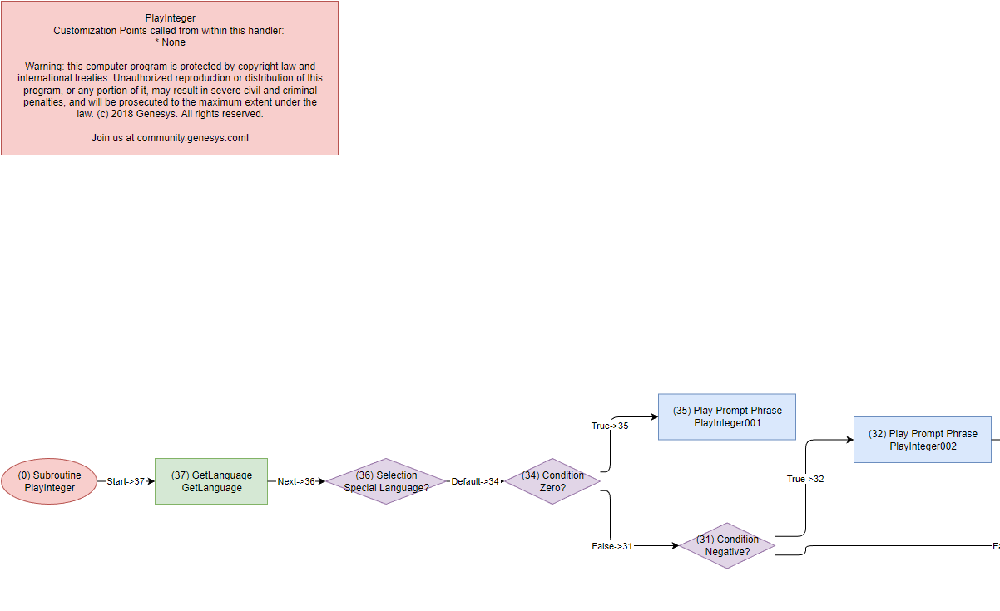

# HandlerVisualizer

## 1. Overview

Convert PureConnect Handler steps to draw.io format.

## 2. Convert handler files to draw.io files

Before you convert handler files to draw.io files, you need to save your handler files as XML format.
There are 2 ways to save as XML files.

### 2.1 Save your handler file as XML format with Interaction Designer

1.  Open your handler ihd file with Interaction Designer
2.  Select Publish
3.  Select File->Export To XML...
4.  Save as XML format

### 2.2 Convert to XML files with Batch Processing

1. Create a list of handlers you want to convert. If your custom handlers are saved in _x_:\I3\IC\Handlers\Custom, create a handlers files list file as HandlerList.lst.
    Note: _x_ = PureConnect installed drive letter, typically D 
   - `cd x:\I3\IC\Handlers\Custom` 
   - `dir /b *.ihd > HandlerList.lst`
2. Create a folder to save xml files
   - `md xml`
3. Run _x_:\i3\ic\server\idu.exe with following options:
    `/HandlerOpenAutoXMLPath=x:\I3\IC\Handlers\Custom\xml /IntermediatePublish:HandlerList.lst /ForcePublishClose`

### 2.2 Create CSV file for draw.io

Intermediate CSV files for draw.io will be created after the XML file imports complete.

### 2.3 Create flowcharts

draw.io will load intermediate CSV files and create handler steps.

### 2.4 Edit flowcharts

There are 2 ways to edit flowcharts:

1. Open with draw.io (web/desktop app) 
   - If you need to amend contents in a flowchart, select shape, and press CTRL+M
2. Open with Visio

Note: The draw.io.exe included in this app was customized for batch processing, so you can NOT use the "SAVE AS" functionality.
You should install official draw.io desktop app or use Visio.

## 3. Installation

1. Install, or validate installed, .NET 6.0 (required)
    https://aka.ms/dotnet-core-applaunch?framework=Microsoft.NETCore.App&framework_version=6.0.0&arch=x64&rid=win10-x64
2. Install draw.io desktop
    https://github.com/jgraph/drawio-desktop/releases/download/v20.7.4/draw.io-20.7.4-windows-installer.exe

3. Download the latest binary from [Releases](https://github.com/tishige/HandlerVisualizer/releases) page
4. Create HandlerVisualizer folder
5. Unzip HandlerVisualizer.ZIP to HandlerVisualizer folder

## 4. How to use

1. Copy XML files to Handlers folder under HandlerVisualizer
2. Run HandlerVisualizer 
   _Note: Replace sample values for handler file name with your actual values._

- Convert single file
  Run `HandlerVisualizer.exe .\Handlers\YourHandlerName.xml`
- Convert multiple files
  Run `HandlerVisualizer.exe -h`

3. You should now see draw.io files of each handler in .\flow folder

#### Command Line argument

| Argument | Description                                  |
| -------- | -------------------------------------------- |
| -d       | Create draw.io file                          |
| -v       | Create draw.io, then convert to Visio format |
| -n       | Create draw.io, then convert to png format   |
| -h       | Load all xml files in Handlers folder        |

## 5. Customize file format and style

Change config values in appsettings.json

| Variables                     | Description                                                                 | Default                |
| ----------------------------- | --------------------------------------------------------------------------- | ---------------------- |
| appendDateTimeToFileName      | Append dateTime value to fileName                                           | false                  |
| customizationPointFirstString | Paint step color in red if tool step label start with the following strings | "\*" "Customized\_" |
| showStepParameters            | Show Input/Output variables or formula of each tool step                    | false                  |
| colorNode                     | Paint shapes                                                                | true                   |
| nodeRound                     | Draw rounded shapes                                                         | false                  |
| lineRound                     | Draw rounded lines                                                          | true                   |
| convertToVisio                | Always convert to Visio format without specifying -v option                 | false                  |
| convertToPng                  | Always convert to png format without specifying -n option                   | true                   |
| layout                        | Draw style. _Possible values are horizontalflow or verticalFlow_         | horizontalflow         |

## 6. TIPS

1. To optimize created handler flow readability and impact, consider reviewing and updating tool step labels from default values.

2. It may take an hour or more to create diagram, if you have hundreds of XML files.

3. While creating flowcharts, draw.io.exe repeatedly starts and stops. Please do not use your computer until flowchart creation completes.

4. If you see a GPU process exited unexpectedly error during convertion to png file(s), please check to see if the png file created successfully.

5. You can convert to png or Visio format later with the following draw.io command line:

   - Convert Sample_Handler.drawio to Sample_Handler.png
      `.\draw.io -x -f png .\Sample_Handler.drawio -o Sample_Handler.png`

   - Convert Sample_Handler.drawio to Sample_Handler.vsdx
      `.\draw.io -x -f vsdx .\Sample_Handler.drawio -o Sample_Handler.vsdx`

   - Convert all .drawio files in c:\temp\flow to visio format, then save to c:\temp\visio
      `.\draw.io -x -f vsdx c:\temp\flow -o c:\temp\visio`
